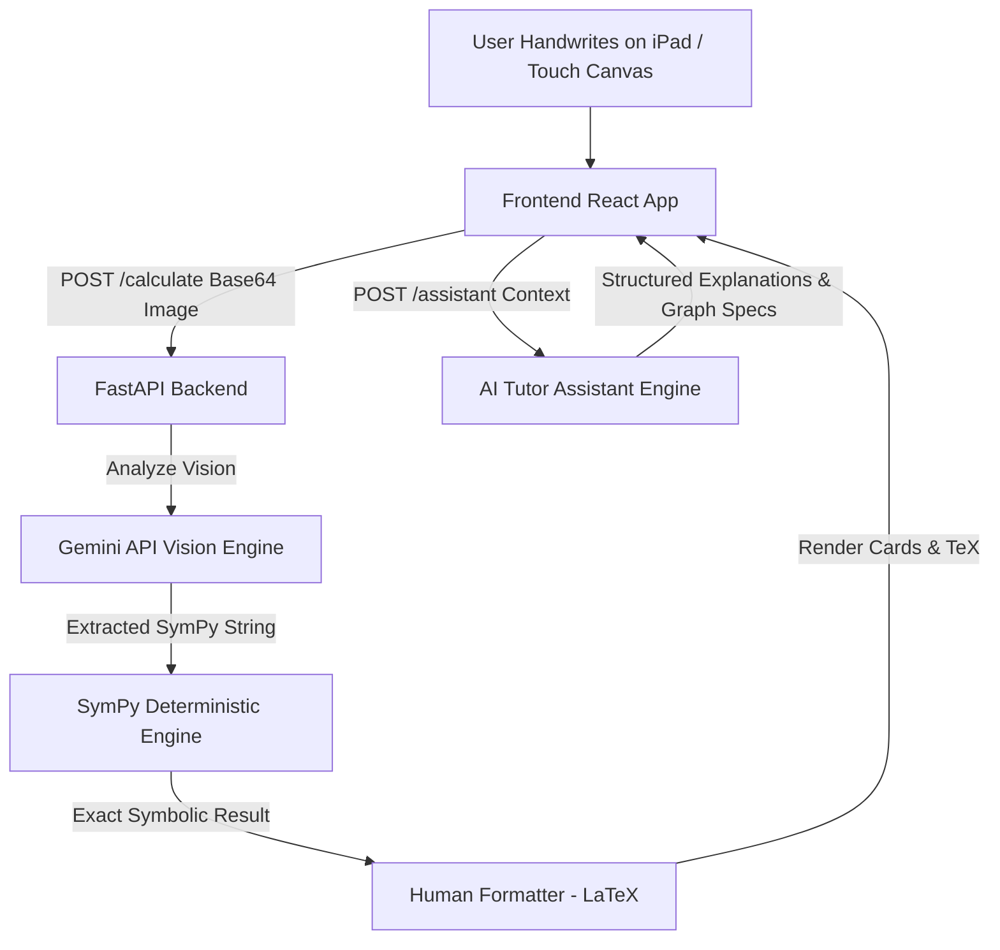

# 🧮 IPAD MATH NOTE — Touch-First Mathematical AI Notebook

> **A production-grade, touch-first digital mathematical notebook for iPad, mobile, and tablet users — powered by Google Gemini API, SymPy Deterministic Engine, React Canvas, and FastAPI.**

---

## 📋 Table of Contents
- [Overview](#-overview)
- [Architectural Philosophy](#-architectural-philosophy)
- [Key Features](#-key-features)
- [System Architecture](#-system-architecture)
- [Tech Stack](#-tech-stack)
- [Directory Structure](#-directory-structure)
- [Getting Started & Local Setup](#-getting-started--local-setup)
- [Vercel Deployment Guide](#-vercel-deployment-guide)
- [Security & API Guarantees](#-security--api-guarantees)
- [License](#-license)

---

## 🌟 Overview

**IPAD MATH NOTE** transforms mathematical problem-solving on touchscreens into an interactive, AI-assisted experience. Users can draw mathematical expressions, calculus problems, and variable assignments directly on a high-DPI canvas using a stylus or finger.

The application combines **multimodal AI vision (Gemini 3.5 Flash-Lite)** with a **deterministic mathematical solver (SymPy)** and a **custom Cartesian graphics engine** to deliver human-centric LaTeX math solutions, step-by-step educational tutoring, real-time Cartesian graphs, and persistent AI tutor history.

---

## 🏛️ Architectural Philosophy

The core design principle of IPAD MATH NOTE strictly enforces clear separation of concerns:

```
[ Gemini Sees ] ➔ [ SymPy Thinks ] ➔ [ Backend Decides ] ➔ [ Frontend Displays ]
```

1. **Gemini API (Multimodal Intelligence)**: Recognizes handwritten math from raw canvas images, acts as an interactive AI tutor, and formats complex step-by-step explanations.
2. **SymPy Engine (Deterministic Precision)**: Performs exact algebraic manipulation, derivative calculation, integration, equation solving, and numerical evaluation to prevent LLM mathematical hallucinations.
3. **Human Formatting Layer (`human_formatter.py`)**: Converts machine syntax (`x**2`, `Rational(3,4)`) into clean, publication-ready TeX (`x^2`, `\frac{3}{4}`).
4. **React Canvas Engine**: Provides 120 FPS high-DPI vector stroke tracking, pointer capture, touch-first action bars, and smooth responsive canvas re-rendering.

---

## ✨ Key Features

### 🖋️ Touch-First High-DPI Canvas
- **Vector Stroke Engine**: Smooth pointer-capture drawing with sub-pixel accuracy.
- **Undo / Redo & Eraser**: Complete vector stroke history stack allowing instant undoing and redo of individual handwriting strokes.
- **Draggable Math Cards**: Solved mathematical solutions render directly on canvas near your handwriting with dismissible controls.

### 🤖 ChatGPT-Style AI Tutor Drawer (`AssistantPanel`)
- **Interactive Session Drawer**: Persistent conversation history stored in `localStorage` with **+ New Chat** session management.
- **Multi-Level Pedagogical Hints**: Progressive hints (Level 1 ➔ Level 3) that guide students without spoiling answers.
- **Solution Verification**: Interactive input box to test your own solution against the AI tutor.

### 📈 Cartesian Graph Plotter (`VisualizationViewer`)
- **Multi-Curve Plotting**: Simultaneously plots original functions $f(x)$ and derived curves $f'(x)$ or antiderivatives.
- **Cartesian Coordinate System**: Real coordinate axes with numeric tick labels (-5 to +5), interactive zoom in/out, grid toggle, and legend filtering.
- **Annotated Critical Points**: Automatic plotting of roots, extrema, and inflection points.

### 🎨 Personalizable Theme Engine (Dark & Bright)
- **Dark Notebook Mode**: High-contrast slate surface (`#090d16`) with glowing emerald accents and subtle academic grid lines.
- **Bright Notebook Mode**: Clean light paper notebook surface (`#ffffff`) with dark navy typography and high-visibility curves.
- **Zero-Reload Persistence**: Dynamic CSS variable mapping (`:root`) persistent in `localStorage`.

---

## 🏗️ System Architecture



---

## 🛠️ Tech Stack

### Frontend
- **Framework**: React 18 + TypeScript + Vite
- **Styling**: Tailwind CSS + Mantine UI + Lucide Icons
- **Math Rendering**: MathJax 2.7 (LaTeX TeX-to-HTML typesetting)
- **State & Storage**: React Context + `localStorage` Session History

### Backend
- **Framework**: Python 3.11 + FastAPI + Uvicorn
- **AI Intelligence**: `google-genai` SDK (`gemini-3.5-flash-lite`)
- **Math Engine**: SymPy (Symbolic Mathematics) + NumPy + Pillow (PIL)
- **Testing**: Pytest (30 Unit & Integration Tests)

---

## 📂 Directory Structure

```
IPAD MATH NOTE/
├── Frontend/                      # React Canvas Single Page Application
│   ├── src/
│   │   ├── components/            # UI Components (AssistantPanel, VisualizationViewer, ThemeSelector)
│   │   ├── screens/home/          # Main Canvas Screen & Pointer Handlers
│   │   ├── themes/                # Extensible Theme System (dark.ts, bright.ts, ThemeContext.tsx)
│   │   ├── types/                 # TypeScript Types & Interfaces
│   │   └── utils/                 # Storage & Chat History Handlers
│   ├── package.json
│   └── vercel.json                # Vercel SPA Rewrites Config
│
├── Backend/                       # FastAPI Serverless Application
│   ├── api/
│   │   └── index.py               # Vercel Serverless Entrypoint
│   ├── apps/calculator/
│   │   ├── assistant_engine/      # AI Tutor, Prompts, Verifier, Human Formatter
│   │   ├── math_engine/           # SymPy Solver, Parser, Normalizer, Serializer
│   │   └── tests/                 # Pytest Test Suite
│   ├── main.py                    # FastAPI Server Definition
│   ├── requirements.txt
│   └── vercel.json                # Vercel Python Builder Config
│
├── .gitignore                     # Root Git Ignore (Excludes secrets & heavy assets)
└── README.md                      # Documentation
```

---

## 🚀 Getting Started & Local Setup

### Prerequisites
- Node.js 18+ & npm
- Python 3.10+
- Google Gemini API Key ([Get one here](https://aistudio.google.com/))

### 1. Backend Setup
```bash
cd Backend

# Create & activate virtual environment (optional)
python -m venv venv
venv\Scripts\activate  # Windows: venv\Scripts\activate

# Install dependencies
pip install -r requirements.txt

# Create .env file with your Gemini key
echo GEMINI_API_KEY=your_actual_gemini_api_key > .env

# Run FastAPI backend server
python main.py
```
*Backend will be running at `http://localhost:8900`.*

### 2. Frontend Setup
```bash
cd Frontend

# Install node dependencies
npm install

# Run Vite development server
npm run dev
```
*Frontend will be running at `http://localhost:5173/`.*

---

## ⚡ Vercel Deployment Guide

Deploying IPAD MATH NOTE to Vercel takes under 2 minutes:

### 1. Deploy Backend (`Backend`)
1. Import `Math-Notebook` repository on [Vercel](https://vercel.com/new).
2. Set **Root Directory** to `Backend`.
3. Add Environment Variable:
   - **`GEMINI_API_KEY`** = `your_gemini_api_key`
4. Click **Deploy** and copy your live backend URL (e.g. `https://math-notebook-be.vercel.app`).

### 2. Deploy Frontend (`Frontend`)
1. Import `Math-Notebook` repository a second time on [Vercel](https://vercel.com/new).
2. Set **Root Directory** to `Frontend`.
3. Add Environment Variable:
   - **`VITE_API_URL`** = `https://math-notebook-be.vercel.app` *(Your Backend URL)*
4. Click **Deploy**.

---

## 🔒 Security & API Guarantees

- **Zero Dynamic Execution**: No `eval()` or `exec()` statements are executed anywhere on the backend.
- **Backend Key Isolation**: `GEMINI_API_KEY` is strictly server-side and never exposed to the client JavaScript bundle or Vite environment.
- **Input Sanitization**: All mathematical expressions are parsed using AST and SymPy white-listed symbols before evaluation.

---

## 📜 License

This project is licensed under the [MIT License](LICENSE).
